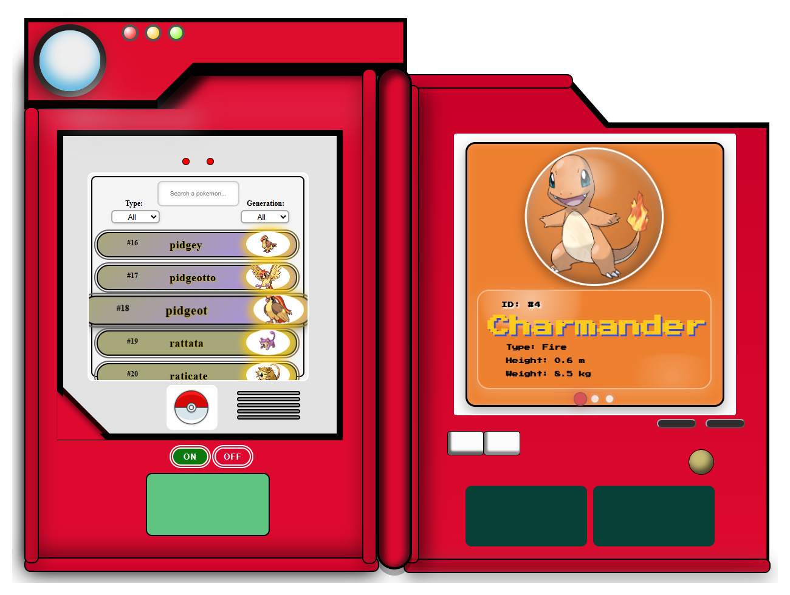
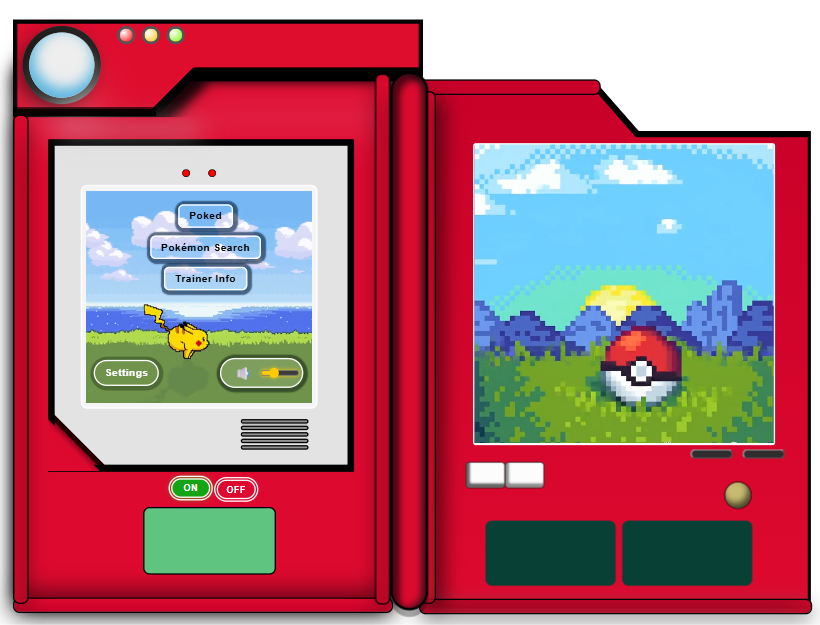
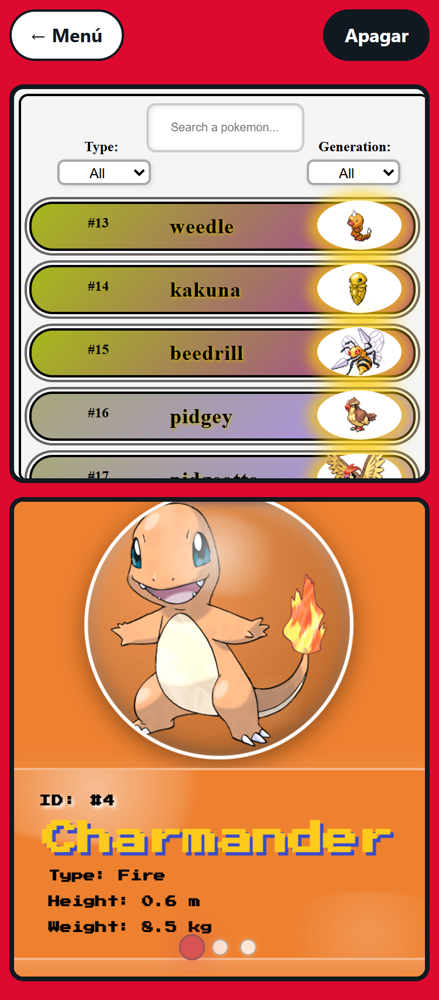
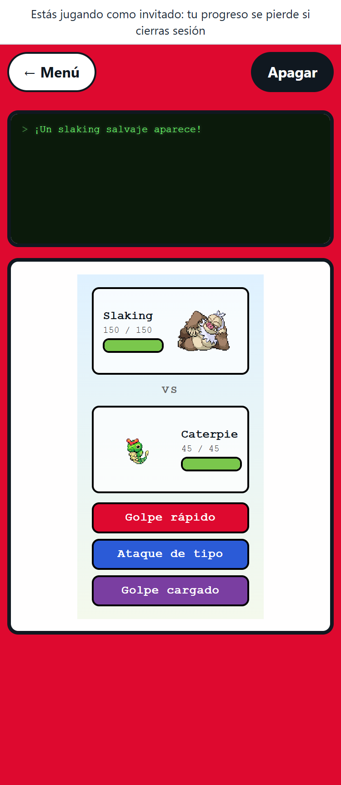

# Pokédex

[](https://github.com/LSvargas25/pokedex-frontend/actions/workflows/ci.yml)

A Pokédex you can actually hold: a two-panel, Kanto-style device built in
Angular, with Pokémon search, trainer accounts, team building and a turn-based
battle mode driven by skill minigames.

**Live demo → [pokedex-frontend-md48.onrender.com](https://pokedex-frontend-md48.onrender.com)**

> The API runs on Render's free plan and sleeps when idle. On the first visit
> the app shows *"Despertando el servidor…"* and retries until it answers
> (usually under a minute).

| Desktop | Tablet | Phone |
| --- | --- | --- |
|  |  |   |

## Features

- **Browse and search** Pokémon by name, type and generation; screen B shows
  the detail card (types, size, abilities, weaknesses, evolution line)
- **Play without an account**: *Jugar como invitado* (Supabase anonymous
  sign-in) is the main option on the login; email/password and *Continuar con
  Google* are there too. The session is restored on reload
- **Protected routes**: `/poked` (battle) and `/trainer` need a session; without
  one the guard opens `/login?returnUrl=...` and returns there after signing in
- **Friendly errors**: Spanish messages with *Reintentar*, a 401 clears the
  local session and asks to log in again, and Supabase errors are translated
- **Trainer profile**: level, XP bar, win/loss record
- **Team selection**: pick 3 Pokémon; stronger ones unlock as the trainer
  levels up (enforced by the backend too)
- **Battle mode (Poked)**: a 3-vs-3 turn-based fight against a random team.
  Each move is gated by a minigame (reaction semaphore, timing bar, keyboard
  letters) whose `miss` / `hit` / `perfect` result scales the damage. HP bars
  animate with GSAP and sound effects are generated with the Web Audio API
- **Responsive**: the device is drawn on a fixed-size canvas that scales to the
  viewport. On portrait phones, once it's on, screens A and B are shown at
  real size, stacked, with a sticky "← Menú / Apagar" bar
- **Visitor-friendly**: links like `/poked` or `/trainer` power the Pokédex on
  by themselves; on `/` the ON button pulses with "Pulsa ON para empezar".
  The profile shows the team with "¡A combatir!", and a battle without a team
  offers "Ir a Trainer Info" and comes back after saving
- **Cold-start aware**: requests to the API retry with backoff while the
  server wakes up, with a status banner instead of empty screens

## Tech stack

| Layer | Tech |
| --- | --- |
| Frontend | Angular 20 (standalone components, signals), TypeScript, RxJS, GSAP, SCSS |
| Auth | Supabase Auth (`@supabase/supabase-js`) |
| Backend | [pokedex-backend](https://github.com/LSvargas25/pokedex-backend): Node.js + Express caching proxy over [PokeAPI](https://pokeapi.co/), trainer data in Supabase (Postgres) |
| Quality | ESLint (angular-eslint), Jasmine + Karma, GitHub Actions CI (lint + build + tests) |
| Hosting | Render (static site + web service) |

## Running locally

Requirements: Node.js 20+ and npm.

```bash
# 1. Backend (http://localhost:3000)
git clone https://github.com/LSvargas25/pokedex-backend.git
cd pokedex-backend
npm install
cp .env.example .env    # fill in SUPABASE_URL and SUPABASE_SERVICE_ROLE_KEY
npm start

# 2. Frontend (http://localhost:4200)
git clone https://github.com/LSvargas25/pokedex-frontend.git
cd pokedex-frontend
npm install
npm start
```

| Command | What it does |
| --- | --- |
| `npm start` | Dev server on http://localhost:4200 (talks to `http://localhost:3000`) |
| `npm run lint` | ESLint over TypeScript and templates |
| `npm test` / `npm run test:ci` | Jasmine + Karma (watch / headless Chrome) |
| `npm run e2e` | Playwright: guest → team → battle against the local stack (needs the backend running; creates a guest user) |
| `npx ng build` | Production build into `dist/Pokefron/browser` (talks to the Render API) |

### Configuration

All API calls go through `environment.apiBaseUrl`:

| File | `apiBaseUrl` |
| --- | --- |
| `src/environments/environment.ts` (dev) | `http://localhost:3000` |
| `src/environments/environment.prod.ts` (production build) | `https://pokedex-backend-lx85.onrender.com` |

Both files also hold `supabaseUrl` and `supabaseAnonKey`. The anon key is public
by design; row-level security in Supabase protects the data. Google sign-in
additionally needs the Google provider enabled in the Supabase dashboard
(Authentication → Providers → Google).

### Routes

| Route | Login | Screen |
| --- | --- | --- |
| `/` | – | Main menu |
| `/search` | – | Pokémon Search |
| `/poked` | required | Battle |
| `/trainer` | required | Trainer profile and team |
| `/settings` | – | Session and links |
| `/login` | – | Guest / Google / email |
| `/privacy` | – | Privacy policy (a normal page, outside the device) |

The device screens follow the URL, so links and the browser's back button work.

### Trying the flow

1. Press **ON**, wait for the intro, then pick **Pokémon Search** and click a
   Pokémon to see its card on the right screen.
2. Open **Trainer Info**: without a session you land on the login. Choose
   **Jugar como invitado** (or Google / email).
3. Click **Elegir equipo**, choose 3 unlocked Pokémon and save.
4. Back in the menu, choose **Poked**: pick a move, play its minigame and watch
   the turn resolve. Wins grant XP; level-ups unlock new Pokémon.

## Backend endpoints used

All requests carry `Authorization: Bearer <supabase access token>` when the
user is signed in (added by an HTTP interceptor). Full API docs live in the
[backend README](https://github.com/LSvargas25/pokedex-backend#api).

| Method | Endpoint | Used for |
| --- | --- | --- |
| `GET` | `/health` | Wake the server on load |
| `GET` | `/api/pokemons`, `/api/pokemons/filter` | Search list |
| `GET` | `/api/pokemons/:idOrName` | Detail card |
| `GET` | `/api/pokemon/roster` | Team selection with unlock levels |
| `GET` / `PUT` | `/api/trainer/me`, `/api/trainer/team` | Profile and team |
| `POST` | `/api/battle/start`, `/api/battle/:id/attack` | Battle |

## Project structure

```
src/app/
  Components/     Pokédex shell, screens A/B, menu options, battle minigames,
                  trainer panels, server wake-up banner
  Services/       API clients (pokemons, trainer, battle), auth, screen state,
                  server status
  Interceptors/   auth token + cold-start retry with backoff
src/environments/ dev / prod configuration
```

## Future improvements

- Unit tests for services and minigames
- Per-species movesets and manual switching of the active fighter
